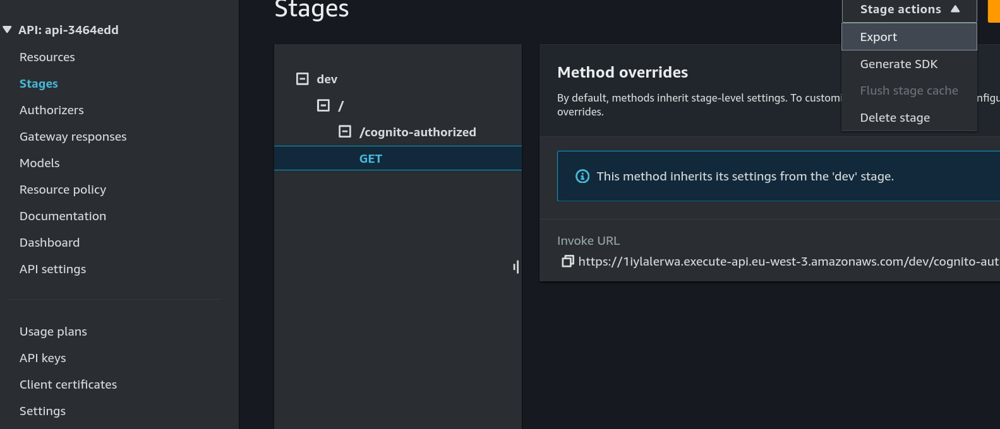

# Routes in API Gateway

This example create an API Gateway which responds to requests using Lambda Function.

When you're finished, you'll be familiar with how to configure routes in API Gateway using the RestAPI.

## Prerequisites

1. [Install Pulumi](https://www.pulumi.com/docs/get-started/install/)
2. [Configure AWS Credentials](https://www.pulumi.com/docs/intro/cloud-providers/aws/setup/)
3. [Install Node.js](https://www.pulumi.com/docs/intro/languages/javascript/)

## Deploy the App

### Step 1: Create a directory and cd into it

For Pulumi examples, we typically start by creating a directory and changing into it. Then, we create a new Pulumi project from a template. For example, `azure-javascript`.

1. Install prerequisites:

    ```bash
    npm install
    ```

2. Create a new Pulumi stack:

    ```bash
    pulumi stack init
    ```

3. Configure the AWS region to deploy into:

    ```bash
    pulumi config set aws:region eu-west-3
    ```

4. Deploy the Pulumi stack:

    ```bash
    pulumi up
    ```

### Step 2: Test your API in Postman
1. Go to AWS Console -> API Gateway -> Select your API -> Stages -> Select your stage -> Stage Actions -> Export.

2. Import the file in Postman
3. Configure the authetication in Postman:
- Type: OAuth 2.0
- Add authorization data to: Request Headers
- Token Name: token
- Grant Type: Authorization Code
- Callback URL: URL defined in user pool client
- Auth URL: Auth URL from the output of command pulumi up
- Access Token URL: Is similar to Auth URL but with /oauth2/token instead of /login
- Client ID: Client ID from the output of command pulumi up
- Client Secret: From AWS Console -> Cognito
- Scope: email
- State: empty
- Client Authentication: Send as Basic Auth header
4. Create a user from Cognito UI. Get new access token -> Sing up and follow the steps
5. Test API with Authorization header: Bearer {access_token} and without it to see the difference

Fetch and review the logs from the Lambda executions:

```bash
pulumi logs
```
## Clean Up

Once you're finished experimenting, you can destroy your stack and remove it to avoid incurring any additional cost:

```bash
pulumi destroy
pulumi stack rm
```

## Summary

In this tutorial, you deployed an API with authorization code flow.

## References
- [Athorization code flow explanation](https://auth0.com/docs/get-started/authentication-and-authorization-flow/authorization-code-flow)
- [Pulumi offcial documentation](https://www.pulumi.com/registry/packages/aws/api-docs/)
- [Reference pulumi tutorial](https://www.pulumi.com/registry/packages/aws-apigateway/how-to-guides/aws-apigateway-ts-routes/)